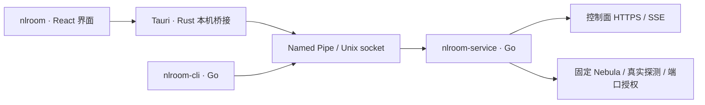

# 客户端需求与技术选型

决策日期：2026-09-10。品牌为 **NodeLane**（`nodelane.net`），子产品为 **NodeLane Room**。桌面 GUI 位于 `desktop/`，CLI 与后台独立交付；真机验收范围见验证记录。

## 产品与进程名

对外显示完整产品名，命令和进程统一使用 `nlroom` 前缀，与已有 `nlroom-node` 一致。应用标识使用 `net.nodelane.room`；桌面首次使用默认连接 `https://room.nodelane.net`，可展开联机服务修改地址。已有设备继续使用自己的服务配置。

| 用途 | Windows 文件/进程 | Linux 文件/进程 | 状态 |
|---|---|---|---|
| 玩家 GUI | `nlroom.exe` | `nlroom` | 已实现，普通用户运行；平台验收见验证记录 |
| AI、脚本与开发调试 CLI | `nlroom-cli.exe` | `nlroom-cli` | 仅发起本机请求 |
| 玩家网络后台 | `nlroom-service.exe` | `nlroom-service` | 承载身份、控制连接、Nebula 与端口授权 |
| lighthouse/relay 节点 | 不发布 | `nlroom-node` | 已有基础设施进程 |

所有 Linux 主程序名均短于 16 字节，便于进程列表辨识。GUI 使用系统 WebView 后还会有平台渲染辅助进程，不能要求任务管理器中只有上述主程序。

Windows 服务注册名继续使用 `NodeLaneRoom`，显示名为 `NodeLane Room`；安装目录 `%ProgramFiles%\NodeLaneRoom`、状态目录 `%ProgramData%\NodeLaneRoom`、管道 `\\.\pipe\NodeLaneRoom` 保持现有值。Linux 桌面身份位于 `/var/lib/nlroom`，本机 socket 位于 `/run/nlroom/agent.sock`；显式 `--state-dir` 保留开发和容器流程。共享控制进程 `nodelane-server`、Go 模块路径、API、镜像和发布包前缀沿用现有名称。

CLI 提供 `--json`、`--watch`、退出码和房间子命令，GUI 发布后继续作为开发与诊断工具维护。完整桌面包支持安装和保留身份的手动更新，不提供旧命令别名或旧身份迁移流程。

## GUI 选择

选择 **Tauri 2 + React + TypeScript + Vite**，配合独立 Go 服务。依据是本仓库已采用 React/TypeScript/Vite、当前交付重心为 Windows/Linux，同时希望保留移动端界面复用路径。下表取舍是对本项目的工程判断，不是性能实测。

| 方案 | 与当前代码的衔接 | 未来平台 | 判断 |
|---|---|---|---|
| Tauri 2 + React | 复用前端工具与通用组件；增加 Rust 薄桥接，经 IPC 调用 Go | 有 Android/iOS 原生插件入口 | 首选；接受 Rust 构建链和系统 WebView 差异 |
| Flutter | 保留 Go 服务，但 UI 改用 Dart，现有 React 组件无法直接复用 | 官方支持 Windows/Linux/macOS/Android/iOS | 若移动端变成首期重点，优先重新评估 |
| Wails 2 + React | Go 与前端衔接最直接，桌面开发成本较低 | 官方支持列表为 Windows/macOS/Linux | 桌面备选；不能把移动端当作现成升级路径 |

支持范围依据 [Tauri 分发文档](https://v2.tauri.app/distribute/)、[Flutter 平台矩阵](https://docs.flutter.dev/reference/supported-platforms)及 [Wails 安装文档](https://wails.io/docs/gettingstarted/installation/)。具体依赖由 `desktop/package-lock.json` 与 `desktop/src-tauri/Cargo.lock` 锁定，不使用浮动版本构建。

## 桌面首版范围

以下为客户端需求，以当前已落地的服务端游戏目录为基线。界面使用简体中文和固定午夜深色主机主题，主入口为“我的房间”，顶部另设“游戏库”，底部控制中心提供“诊断”“设置”；游戏导入和配置继续由独立管理台负责。

| 流程 | 客户端行为 |
|---|---|
| 首次使用 | 检查本机服务与协议版本，填写昵称初始化；默认 HTTPS 控制端为 `https://room.nodelane.net`，地址可展开修改；单控制端、设备身份认证，已有身份显示公开配置 |
| 游戏库 | 从服务端读取已启用游戏，按名称搜索，显示封面、简介、背景及端口用途；通用游戏保持可选；图片失败使用本地占位，不阻止房间操作 |
| 建房与入房 | 选择游戏并填写房名建房，或直接输入邀请码入房；入房以服务端返回的游戏为准；复制邀请码并显示有效期，刷新页面不自动换码 |
| 我的房间 | 展示当前连接与本人管理的有效房间，区分“正在联机”和“仅管理”；离房后仍可管理，关闭或到期后不可继续操作；邀请换新、踢人、转让和关闭按服务端权限提供 |
| 游戏连接 | 展示成员虚拟 IP、已登记 TCP/UDP 端口及复制入口；说明游戏实际监听须匹配配置；端口授权、隧道状态和游戏实际可连接分别表达 |
| 端口与配置变化 | 已配置游戏的端口只读；通用游戏仅增删本机端口，显示待同步、已登记及删除失败；服务端规则变化按实际状态显示同步或重新连接；停用时展示游戏端口撤回状态，保留房间管理与诊断 |
| 状态与诊断 | 展示实际直连/中继、真实 RTT/丢包，未知或陈旧值明确标识；区分服务不可达、权限不足、版本不兼容、控制失联和授权到期；提供手动探测与脱敏诊断复制 |
| 桌面生命周期 | 单实例、托盘、必要通知；关闭窗口收至托盘并继续联机，无可用托盘时保留可找回的窗口；“退出界面”保留后台，“离房并退出”须确认离房结果；GUI 开机启动可选且默认关闭 |

游戏目录、端口限制、配置停用及失败撤销语义以 [游戏目录与网络规则](architecture.md#游戏目录与网络规则) 和 [当前操作](../README.md#游戏管理) 为准，不在客户端另设规则。目录获取失败须显示错误或陈旧状态，不能当作空目录或据此认定游戏已停用；建房、入房和端口操作始终由服务端重新校验。

首版使用虚拟 IP 与授权端口直连。Minecraft 与其他已配置游戏走同一流程，不恢复已删除的专用公告、代理或自动发现；通用 LAN 发现按 [游戏网络规划](game-network.md) 后续验证。游戏被收录或导入 Steam 资料不代表已完成游戏兼容性验收。多控制端切换、玩家账号、游戏安装/启动、公共房间大厅和自动更新不纳入首版。

## 主机界面与设计令牌

视觉参考仅来自游戏主机系统：[Sony PS5 系统设计](https://www.sony.com/en/SonyInfo/design/stories/PS5/)的沉浸背景、横向游戏选择和控制中心，以及 Xbox 的清晰焦点与大尺寸操作区。客户端不复用管理台布局、组件或配色，也不使用 PS/Xbox 标志与专属按键符号。

采用“午夜”主题与[无边框窗口](https://v2.tauri.app/learn/window-customization/)，顶部集成房间、游戏库、网络诊断、设置、个人入口及最小化／最大化／关闭；空白标题区支持拖动和双击最大化，关闭行为沿用托盘或最小化。完全移除底部栏。首页仅保留创建房间与邀请码入房两个入口；游戏库保留封面选择、搜索和创建房间，不展示邀请码入口、游戏介绍或端口。房间切换卡带游戏封面，成员名片保留头像、角色、可复制 IP 和实测链路；房主管理操作收在成员菜单中，Escape 关闭并回到菜单入口。头像复用原创氛围素材和昵称首字符，不代表账号头像或在线状态。

诊断按连接概览、虚拟 IP／授权、系统检查和成员链路呈现；系统报告标注检查时间，逐成员延迟与丢包仅在当前快照和授权有效时展示，未知值不填零。原始 JSON 不进入界面；复制使用字段白名单生成脱敏中文摘要。设置按桌面偏好、设备信息、版本与更新、退出与联机分类；服务不可用时仍可打开设置和诊断。检查更新目前仅为界面占位，点击明确提示尚未接入在线服务，不请求发布源、不下载、不声称已是最新版。

数值只在 [tokens.css](../desktop/src/styles/tokens.css) 维护，组件通过语义变量引用。

| 令牌组 | 变量与职责 |
|---|---|
| 文字 | `--font-mono`、`--text-xs/sm/md/lg/xl/title/display`；系统中西文字体、等宽网络地址、16px 正文、13–14px 辅助信息与响应式展示字阶 |
| 排版 | `--weight-regular/title/medium`、`--leading-body/title`、`--tracking-label`；轻标题、中等按钮、舒展正文 |
| 表面 | `--bg/surface/panel/panel-raised/input/hover`；舞台、玻璃面板、弹窗、输入和悬停层次 |
| 卡片 | `--card/card-active/card-edge`、`--shadow-card`；玩家名片、房间选择与系统设置的轻玻璃表面和本机强调 |
| 内容与边界 | `--text/muted/subdued`、`--line/line-strong`；主要文字、辅助说明及轻边框 |
| 操作 | `--accent/accent-soft`、`--primary/on-primary`、`--focus-ring`；冰蓝强调、银白主按钮和双层焦点环 |
| 状态 | `--success/warning/danger`、`--warning-surface/danger-surface`；配合明确文字表达运行、异常和危险操作 |
| 间距 | `--space-1/2/3/4/5/6/8/10/12/16`；4px 基础节奏到大留白 |
| 尺寸 | `--radius-sm/md/lg/pill`、`--control-height`、`--page-gutter/max`、`--header-height`；组件形状与响应式框架 |
| 材质 | `--blur-panel`、`--shadow/shadow-dialog`、`--scene-scrim`；有层次的透明表面、对比遮罩与阴影 |
| 动效与层级 | `--duration-fast/normal/scene`、`--ease-out`、`--layer-scene/header/feedback`；轻交互、场景淡入、固定顶部导航与通知 |

游戏库支持左右方向键、Home/End、前后按钮和横向滚动；搜索后始终选中可见游戏。Tab/Enter 操作全部主要功能，弹窗自动聚焦输入，Escape 关闭非忙碌弹窗。减少动态效果时取消动画与过渡；系统强制配色保留选中边界。小窗口允许内容纵向滚动，顶部导航和窗口按钮始终可达。

游戏图片继续通过原有本机图片通道读取。缺图使用随包原创氛围图 `desktop/public/assets/console-ambient.png`，由内置 Image Gen 生成；提示语为“午夜蓝游戏主机氛围背景，右侧透明银蓝丝带、稀疏微光，左侧与底部留暗部，无文字、标志或界面”。它仅作装饰，不代表游戏或网络状态。

开发：`cd desktop` 后运行 `npm ci`、`npm run dev`。普通入口使用真实桌面 IPC；`http://127.0.0.1:1420/preview.html` 是独立开发预览，可用 `?state=room/setup/error` 检查房间、初始化和服务故障。该预览明确显示示例标识、使用公开 Steam 封面、不会建立隧道或访问控制端；不进入正式桌面构建。检查命令为 `npm run build` 和 `npm test`。

## 桌面架构

Go 包边界与本机权限见 [架构说明](architecture.md)；桌面实现遵循以下约束。

- GUI 和 CLI 均为普通用户入口；服务独立于窗口存活，关闭窗口不等于离房。退出房间明确调用现有 leave；后台停机仍关闭隧道。
- Rust 只负责窗口、托盘、通知和有界本机 IPC。复用现有 `/rpc` 动作与 JSON 模型，不解析 CLI 表格，也不重新实现房间、证书和网络状态机。GUI 不读取身份私钥、隧道密钥或设备会话。
- 页面、脚本和样式只加载随包发布的资源；游戏图片由 Go 服务从已配置控制端经受限本机通道提供，只接受游戏 ID 与封面/背景类型，限制大小、格式、并发和缓存。界面不访问 Steam，不接受任意图片 URL，不嵌入远端页面。桥接只允许具名玩家操作，服务继续校验请求，不暴露任意命令执行、文件路径或管理员接口。
- Windows 使用现有绑定安装用户 SID 的 Named Pipe。安装器负责提权安装服务和 Wintun；GUI 不以管理员/SYSTEM 身份运行，网络后台不作为随窗口启停的普通子进程。
- Linux 桌面状态目录 `/var/lib/nlroom` 由 root 持有，权限为 `0700`；socket 独立位于 `/run/nlroom/agent.sock`，权限为 `0600`，绑定 `/etc/nlroom/owner.uid` 指定的安装用户。服务校验对端 UID，客户端校验服务端 root UID；GUI 不使用 sudo。显式状态目录继续用于同用户的容器回归；宿主 systemd 安装尚待真机验收。
- 首版复用 status 轮询，请求不重叠，操作完成后刷新，失败退避并标识陈旧数据；本机事件订阅后续按需添加。兼容版本检查、公开配置查询和稳定错误码随首版实现，并同步契约和测试。API 请求仍由 Go 服务发送，敏感值不进前端持久存储或日志。

本机 `games`、`create/join`、`members`、房主管理动作、`port/remove-port`、`status`、`ping` 和 `doctor` 沿用原有流程；首版补齐以下接口，协议类型在既有 `localapi`/`model` 边界内维护：

- 公开配置与服务/本机协议版本，仅返回服务器、昵称、设备标识等非秘密字段；稳定错误码保留可读详情，不依赖匹配错误文本决定操作。
- `rooms/manage` 提供本人管理的有效房间查询，以及离房房主可读取的管理摘要和成员；管理视图校验房主身份，不授予联机权限。
- 当前房间的游戏启用状态与配置版本随权威快照读取，不从已启用目录缺项推断停用原因。
- 游戏图片的有界本机读取，以及本机期望端口与服务端实际登记的区分；图片不塞入周期状态响应，删除请求失败不能显示为已立即撤销。

首期目标为 Windows 10/11、Ubuntu 22.04/24.04 与 Debian 12/13，先验收 x64，再验收 ARM64；不把 Go 交叉编译通过等同于 GUI 真机支持。Tauri Windows 依赖 WebView2，Linux 依赖 WebKitGTK 4.1 等系统库，须在目标发行版构建和测试。[构建前置条件](https://v2.tauri.app/start/prerequisites/)

Windows 使用 [NSIS 3 Modern UI 2](https://nsis.sourceforge.io/Docs/Modern%20UI%202/Readme.html) 打包，整合 GUI、服务、Wintun 与微软官方 WebView2 引导程序，提供品牌安装、更新恢复与独立卸载界面。安装生命周期工具只解压到临时目录，运行目录不包含脚本；正式发布须签名，开发验收生成明确标识的未签名测试包。Linux 交付 deb 配套 systemd，RPM 后续按目标发行版需求增加。完整包更新保留身份与安装用户绑定，替换前停止并等待后台；Windows 新程序启动失败自动恢复旧程序，Linux 由 dpkg 报告配置失败并支持重新配置或安装兼容旧包。不迁移旧身份或旧数据库。AppImage 不能单独解决后台权限与服务安装，暂不作为唯一交付物。操作单处维护于 [安装与更新](../README.md#windows-客户端)。

仅构建 GUI 可运行 `cargo build --manifest-path desktop/src-tauri/Cargo.toml --locked --release --features custom-protocol`，前置为前端构建。安装包由 `python scripts/desktop/build.py --platform windows --arch amd64 --release <同一源码构建的 Go 发布目录>` 生成到 `dist/desktop/`；Linux 改用 `--platform linux`，须具备对应系统库与打包工具。脚本不安装服务。Linux deb 安装后显式运行 `sudo nlroom-setup --owner <普通用户>` 绑定用户并启动服务；卸载保留身份与用户绑定。平台安装与完整联机验收范围以验证记录为准。

## 后续平台的实际边界

可复用 React 页面、房间流程、JSON 协议和 Go 中不依赖桌面系统的逻辑；原生 VPN 生命周期必须逐平台接入。Tauri [移动插件](https://v2.tauri.app/develop/plugins/develop-mobile/)支持 Kotlin/Java 与 Swift，但 [Shell 插件](https://v2.tauri.app/plugin/shell/)在 Android/iOS 只支持打开 URL，不能把桌面 Go 可执行文件方案直接搬到手机。

- Android：用原生 `VpnService` 获得 TUN、处理用户授权、保护隧道 socket 和前台服务生命周期；Go 核心是否可通过原生库嵌入需单独验证。[Android VPN](https://developer.android.com/develop/connectivity/vpn)
- iOS：需 `Network Extension` / `NEPacketTunnelProvider`，验证扩展生命周期、内存和后台限制，并使用 macOS/Xcode 构建签名。[Apple Packet Tunnel](https://developer.apple.com/documentation/networkextension/nepackettunnelprovider)
- macOS：界面可继续使用 Tauri；仍需验收 TUN、后台授权、签名与公证以及睡眠恢复。

固定 Nebula 补丁目前只验收桌面路径，移动端是否能接入系统提供的 TUN 句柄仍未验证。必须先做小型集成验证；若需改变已锁定的数据面依赖，另行评审与授权。保持现有薄封装，不提前建立传输 Provider 抽象。通用 LAN 发现仍在规划，见 [游戏网络规划](game-network.md)；不能宣称移动端游戏兼容。

## 实施顺序与验收

1. **接口与权限**：复用已交付 CLI、后台和游戏目录，补齐首版接口需求及 Linux 普通用户控制 root 服务的安装与 UID 校验。
2. **桌面流程**：新增独立客户端前端目录，打通真实本机 IPC、游戏资料/图片、建房入房、房主管理、端口、状态和诊断；覆盖目录失败、游戏停用、规则替换、删除失败与表单重复提交。
3. **桌面交付**：完成托盘、通知、全新安装/卸载；验收 Windows SID 隔离、Linux UID 隔离、GUI 崩溃不影响联机、撤销及凭据到期停网、睡眠恢复、X11/Wayland、中文输入与无障碍。记录包大小、空闲/联机内存和启动耗时，依据实测决定是否调整框架；实际检查和未验证项只在 [验证记录](validation.md) 维护。
4. **未来扩展**：通用 LAN 发现按独立方案验证；在线签名更新、Android、macOS、iOS 按实际需求推进，移动平台先验证系统 VPN 与固定 Nebula，再扩展界面。当前不承诺移动端完成日期或免适配迁移。
