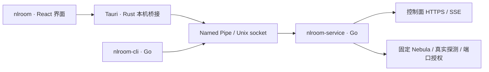

# 桌面客户端设计

本文维护当前桌面交互、桥接和平台边界。GUI 已在 `desktop/` 实现；实际通过范围与未验收项只在 [验证记录](validation.md) 维护。安装和构建步骤见 README。

## 产品与进程名

对外显示完整产品名，命令和进程统一使用 `nlroom` 前缀，与已有 `nlroom-node` 一致。应用标识使用 `net.nodelane.room`；控制端选择见下方首次使用流程。

| 用途 | Windows 文件/进程 | Linux 文件/进程 | 状态 |
|---|---|---|---|
| 玩家 GUI | `nlroom.exe` | `nlroom` | 已实现，普通用户运行；平台验收见验证记录 |
| AI、脚本与开发调试 CLI | `nlroom-cli.exe` | `nlroom-cli` | 仅发起本机请求 |
| 玩家网络后台 | `nlroom-service.exe` | `nlroom-service` | 承载身份、控制连接、Nebula 与端口授权 |
| lighthouse/relay 节点 | 不发布 | `nlroom-node` | 已有基础设施进程 |

所有 Linux 主程序名均短于 16 字节，便于进程列表辨识。GUI 使用系统 WebView 后还会有平台渲染辅助进程，不能要求任务管理器中只有上述主程序。

Windows 服务注册名继续使用 `NodeLaneRoom`，显示名为 `NodeLane Room`；安装目录 `%ProgramFiles%\NodeLaneRoom`、状态目录 `%ProgramData%\NodeLaneRoom`、管道 `\\.\pipe\NodeLaneRoom` 保持现有值。Linux 桌面身份位于 `/var/lib/nlroom`，本机 socket 位于 `/run/nlroom/agent.sock`；显式 `--state-dir` 保留开发和容器流程。共享控制进程 `nodelane-server`、Go 模块路径、API、镜像和发布包前缀沿用现有名称。

CLI 提供 `--json`、`--watch`、退出码和房间子命令，作为开发与诊断工具维护。完整桌面包支持保留身份的自动下载与系统更新，不提供旧命令别名或旧身份迁移流程。

## GUI 选择

2026-09-10 选择 **Tauri 2 + React + TypeScript + Vite**，配合独立 Go 服务：复用仓库前端工具，优先 Windows/Linux，接受 Rust 构建链和系统 WebView 差异。该选择不是性能实测结论，也不代表移动端网络层可直接复用。依赖由 `desktop/package-lock.json` 与 `desktop/src-tauri/Cargo.lock` 锁定。

正式 GUI 从 `desktop/index.html` → `src/main.tsx` → `app/App.tsx` 加载 React 界面，操作经 Tauri `player_request` 连接 Go 服务。开发预览复用相同组件，仅 `preview.tsx` 注入示例数据；生产构建不包含预览入口或模拟实现。

## 当前交互范围

界面支持简体中文和 English，使用暖白背景与珊瑚色操作按钮。首次打开（包括已有身份首次使用本版）先选择语言，再读取本机服务；选择保存在本机，可在设置 → 桌面偏好 → 界面语言中切换，日期、托盘和通知随之更新。存储不可用时仅在当前会话记住选择。顶部产品入口返回房间列表，右侧提供网络诊断、设置和个人下拉菜单；窗口操作只保留关闭按钮；游戏导入与配置由独立管理台负责。

| 流程 | 客户端行为 |
|---|---|
| 首次使用 | 检查本机服务与协议版本，填写昵称初始化；GUI 使用 `https://room.nodelane.net`，初始化和账号登录均不提供服务端地址设置；已有身份沿用后台保存的控制端，设备信息只读显示公开配置 |
| 游戏选择 | 建房弹窗从服务端读取已启用游戏，在一个表单内选择游戏并填写房名；图片失败不阻止房间操作 |
| 建房与入房 | 选择游戏并填写房名建房，或直接输入邀请码入房；入房以服务端返回的游戏为准；复制邀请码并显示有效期，刷新页面不自动换码 |
| 我的房间 | 展示当前连接与本人管理的有效房间，区分“正在联机”和“仅管理”；离房后仍可管理，关闭或到期后不可继续操作；邀请换新、踢人、转让和关闭按服务端权限提供 |
| 游戏连接 | 展示成员虚拟 IP、服务端配置的 TCP/UDP 端口及复制入口；说明游戏实际监听须匹配配置；端口授权、隧道状态和游戏实际可连接分别表达 |
| 端口与配置变化 | 所有游戏端口与发现规则由后端统一管理，客户端只读；服务端规则变化按实际状态显示同步或重新连接；停用时展示游戏端口撤回状态，保留房间管理与诊断 |
| 状态与诊断 | 展示实际直连/中继、真实 RTT/丢包，未知或陈旧值明确标识；区分服务不可达、权限不足、版本不兼容、控制失联和授权到期；后台自动探测，最近 30 秒 RTT/丢包只在房间成员表展示 |
| 桌面生命周期 | 单实例、托盘、必要通知；关闭窗口收至托盘并继续联机，无可用托盘时保留可找回的窗口；“退出界面”保留后台，“离房并退出”须确认离房结果；GUI 开机启动可选且默认关闭 |

游戏规则与停用语义见 [游戏目录与网络规则](architecture.md#游戏目录与网络规则)。目录失败显示错误或陈旧状态，不据此认定游戏停用；房间当前启用状态与配置版本取自权威快照。建房、入房和管理操作均由服务端重新校验。

统一 Ethernet LAN 的单播、广播/组播组件已实现，游戏本体兼容仍须 [验收](game-network.md#能力与验收边界)，收录资料不代表已验收。多控制端切换、游戏安装/启动和公共大厅不在当前范围。

客户端文案按语言独立维护于 `desktop/src/i18n/locales/zh-CN.json` 和 `en-US.json`，Rust 托盘及通知复用同一字典。两份字典的键与插值参数必须一致；组件不内嵌翻译。游戏名称、房名、玩家名、管理员配置和后台原始诊断保留来源内容；有稳定错误码的操作失败按界面语言显示。安装器独立使用 `scripts/desktop/locales/zh-CN.nsh` 和 `en-US.nsh`，先选择安装语言，卸载沿用安装选择；与客户端语言偏好分别保存。

## 界面与视觉规范

界面采用独立重建的暖白与珊瑚色设计：顶部窄导航、左侧房间列表、右侧邀请码加入与创建房间区、底部连接状态。房间列表仅展示本人管理的房间与当前房间，不代表公共大厅；未加入的房间只显示容量上限，不推测在线人数。

建房限制由 `/v2/me.room_creation` 经本机 status 提供，按钮旁明确显示原因，提供刷新或更新入口。限制只影响建房；账号仍能登录、查询、加入和管理已有房间。服务端在建房事务内再次检查，包括已缓存的幂等请求。注销、删除、设备撤销、游戏停用和强制更新分别按原有授权边界处理。

房间详情左侧为共享列宽的成员表，按昵称、虚拟 IP、连接方式、往返延迟、丢包率与管理操作排列；右侧展示游戏与房间信息、邀请/离房、重试/关闭菜单和连接配置，不显示加入邀请码表单或暂停网络按钮。危险动作仍确认。成员统计由本机服务每 5 秒自动探测，显示最近 30 秒平均 RTT 与丢包率；有效的全失败探测显示 100% 丢包，本机、无测量与过期数据使用“—”。连接方式来自真实 Nebula 隧道，独立于测量结果；头像不代表在线状态。

设置使用顶部分类；“退出界面（继续联机）”和“离房并退出”位于个人下拉菜单，后者须先确认并成功离房。诊断页按连接/授权状态与本机系统检查组织，不展示成员链路、网络接口明细或复制诊断按钮。服务不可用时仍可打开设置、更新与诊断，受影响动作显示原因；上次诊断标注检查时间。更新与系统安装流程见 [客户端更新](updates.md)。

颜色与字体在 [tokens.css](../desktop/src/styles/tokens.css) 维护，其余样式按基础、布局、表单、反馈分工。窄窗口改为纵向流，Tab/Enter 可操作主要功能，焦点有明确边框；减少动态效果与系统强制配色受支持。游戏图片仍经受限本机通道读取，缺图使用明确的游戏图标。

无边框窗口使用暖灰细边、内侧高光与轻渐变，Windows 启用系统阴影，保留关闭按钮、拖动区域与托盘行为。窗口分为常驻顶栏、独立滚动内容区与常驻底栏，首次语言选择也沿用三段布局；内容区、表格与弹窗隐藏滚动条，仍支持滚轮、触控板和键盘滚动，切换主页面或房间详情时内容区回到顶部。`preview.html?state=restricted/room/setup/error` 为独立开发预览；省略 state 展示可建房状态，`lang=en-US` 可检查英文。预览标明示例数据，使用公开 Steam 封面，不建立隧道或访问控制端，不进入正式构建。

## 桌面架构

Go 包边界与本机权限见 [架构说明](architecture.md)；桌面实现遵循以下约束。

- GUI 和 CLI 均为普通用户入口；服务独立于窗口存活，关闭窗口不等于离房。退出房间明确调用现有 leave；后台停机仍关闭隧道。
- Rust 只负责窗口、托盘、通知和有界本机 IPC。复用现有 `/rpc` 动作与 JSON 模型，不解析 CLI 表格，也不重新实现房间、证书和网络状态机。GUI 不读取身份私钥、隧道密钥或设备会话。
- 页面、脚本和样式只加载随包发布的资源；游戏图片由 Go 服务从已配置控制端经受限本机通道提供，只接受游戏 ID 与封面/背景类型，限制大小、格式、并发和缓存。界面不访问 Steam，不接受任意图片 URL，不嵌入远端页面。桥接只允许具名玩家操作，服务继续校验请求，不暴露任意命令执行、文件路径或管理员接口。
- Windows 使用现有绑定安装用户 SID 的 Named Pipe。安装器负责提权安装服务，专用 TAP-Windows6 网卡按 README 独立准备；GUI 不以管理员/SYSTEM 身份运行，网络后台不作为随窗口启停的普通子进程。
- Linux 桌面状态目录 `/var/lib/nlroom` 由 root 持有，权限为 `0700`；socket 独立位于 `/run/nlroom/agent.sock`，权限为 `0600`，绑定 `/etc/nlroom/owner.uid` 指定的安装用户。服务校验对端 UID，客户端校验服务端 root UID；GUI 不使用 sudo。显式状态目录继续用于同用户的容器回归；宿主 systemd 安装尚待真机验收。
- 使用 status 轮询，请求不重叠，操作后刷新，失败退避并标识陈旧数据；服务及协议版本不兼容时禁止操作。API 请求由 Go 服务发送，敏感值不进前端持久存储或日志。

本机协议版本 3（`interaction-1`），动作和字段以 `internal/localapi`、`internal/model` 及 Rust 桥接白名单为准。公开配置仅返回服务器、昵称、设备标识等非秘密字段；用稳定错误码判断失败，不匹配错误文案。GUI 按服务实例 ID 与递增序号丢弃旧回复；成员、管理权限、网络、操作和控制可达性独立显示。`network-stop` 暂停意图持久化，独立于控制请求；重试网络不会加入房间。未知提交保持待确认并显示原操作查询，不能自动另发建房/入房。

邀请明文仅存当前弹窗内存，定时核对元信息，换码、失效或失去权限后清除；服务实例或身份变化重建房间视图。未决收据保留原 ID，但服务实例变化后清除界面回调；接管确认后用新的子步骤完成原入房。OIDC 登录入口先查公开能力，同一浏览器事务可重新打开。详情见[事务与快照](architecture.md#事务与快照)。

`rooms/manage` 校验房主身份，离房后的管理视图不授予联机权限；图片单独读取，不塞入周期状态响应。

首期目标为 Windows 10/11、Ubuntu 22.04/24.04 与 Debian 12/13，先验收 x64，再验收 ARM64；不把 Go 交叉编译通过等同于 GUI 真机支持。Tauri Windows 依赖 WebView2，Linux 依赖 WebKitGTK 4.1 等系统库，须在目标发行版构建和测试。[构建前置条件](https://v2.tauri.app/start/prerequisites/)

Windows 使用 NSIS 3 Modern UI 2 和原生 `nlroom-update.exe` 整合 GUI、服务、安装与卸载，不执行 PowerShell。WebView2 作为已有环境前提；GUI 启动时检查 TAP，仅缺失时通过原生助手提权创建。正式发布须签名。Linux 交付 deb 配套 systemd，AppImage 不作为唯一交付物。更新保留身份与安装用户绑定，替换前停止并等待后台；安装与修复操作单处维护于 [Windows 安装](../README.md#windows-客户端) 和 [Linux 安装](../README.md#linux-桌面与客户端开发)。

构建命令与依赖见 [开发与构建](../README.md#开发与构建)，产物统一放 `dist/desktop/`。构建成功不代表服务安装或完整联机已验收。

账号操作位于设置 → 设备信息。普通用户的 Rust 桥接只为 Go 服务返回的受限登录地址打开系统浏览器；登录证明和候选设备私钥保存在受保护的 `login.bin`，界面仅收到地址、状态及用户资料。服务重启后可继续领取；切换账号需要明确确认且不合并访客数据，成功前保留原身份。退出正式账号关闭网络并持久标记退出，后台重启不自动重新登录。取消等待只清除本机待领取状态，不撤销已在浏览器确认的授权；未完成的服务端事务五分钟后过期。

## 后续平台的实际边界

Android、iOS、macOS 尚无已验收的产品交付。可复用页面、房间流程和 JSON 协议；系统网络入口、后台生命周期及当前 Ethernet LAN 语义须逐平台验证，不能直接沿用桌面 Go 服务部署方式。

- Android：用原生 `VpnService` 获得 TUN、处理用户授权、保护隧道 socket 和前台服务生命周期；Go 核心是否可通过原生库嵌入需单独验证。[Android VPN](https://developer.android.com/develop/connectivity/vpn)
- iOS：需 `Network Extension` / `NEPacketTunnelProvider`，验证扩展生命周期、内存和后台限制，并使用 macOS/Xcode 构建签名。[Apple Packet Tunnel](https://developer.apple.com/documentation/networkextension/nepackettunnelprovider)
- macOS：界面可继续使用 Tauri；仍须验证系统虚拟网卡与 Ethernet LAN 接入、后台授权、签名与公证及睡眠恢复。

扩展前先做固定 Nebula 与系统网络入口的小型集成验证；依赖变更另行评审与授权，不预建传输 Provider。其他平台按实际需求推进，不承诺完成日期或移动端游戏兼容。
