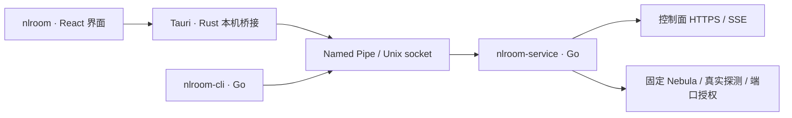

# 客户端命名与技术选型

决策日期：2026-09-10。品牌为 **NodeLane**（`nodelane.net`），子产品为 **NodeLane Room**。CLI 与后台独立交付，GUI 尚未实现。

## 产品与进程名

对外显示完整产品名，命令和进程统一使用 `nlroom` 前缀，与已有 `nlroom-node` 一致。未来应用标识使用 `net.nodelane.room`；`room.nodelane.net` 可作为产品站域名规划，不代表已部署控制端，也不设为客户端默认服务器。

| 用途 | Windows 文件/进程 | Linux 文件/进程 | 状态 |
|---|---|---|---|
| 玩家 GUI | `nlroom.exe` | `nlroom` | 预留，普通用户运行 |
| AI、脚本与开发调试 CLI | `nlroom-cli.exe` | `nlroom-cli` | 仅发起本机请求 |
| 玩家网络后台 | `nlroom-service.exe` | `nlroom-service` | 承载身份、控制连接、Nebula 与端口授权 |
| lighthouse/relay 节点 | 不发布 | `nlroom-node` | 已有基础设施进程 |

所有 Linux 主程序名均短于 16 字节，便于进程列表辨识。GUI 使用系统 WebView 后还会有平台渲染辅助进程，不能要求任务管理器中只有上述主程序。

Windows 服务注册名继续使用 `NodeLaneRoom`，显示名为 `NodeLane Room`；安装目录 `%ProgramFiles%\NodeLaneRoom`、状态目录 `%ProgramData%\NodeLaneRoom`、管道 `\\.\pipe\NodeLaneRoom` 保持现有值。Linux 使用配置目录和 `agent.sock` 保存身份并提供本机通信。共享控制进程 `nodelane-server`、Go 模块路径、API、镜像和发布包前缀沿用现有名称。

CLI 提供 `--json`、`--watch`、退出码和房间子命令，GUI 发布后继续作为开发与诊断工具维护。当前仅支持全新安装，不提供旧命令别名或旧身份迁移流程。

## GUI 选择

选择 **Tauri 2 + React + TypeScript + Vite**，配合独立 Go 服务。依据是本仓库已采用 React/TypeScript/Vite、当前交付重心为 Windows/Linux，同时希望保留移动端界面复用路径。下表取舍是对本项目的工程判断，不是性能实测。

| 方案 | 与当前代码的衔接 | 未来平台 | 判断 |
|---|---|---|---|
| Tauri 2 + React | 复用前端工具与通用组件；增加 Rust 薄桥接，经 IPC 调用 Go | 有 Android/iOS 原生插件入口 | 首选；接受 Rust 构建链和系统 WebView 差异 |
| Flutter | 保留 Go 服务，但 UI 改用 Dart，现有 React 组件无法直接复用 | 官方支持 Windows/Linux/macOS/Android/iOS | 若移动端变成首期重点，优先重新评估 |
| Wails 2 + React | Go 与前端衔接最直接，桌面开发成本较低 | 官方支持列表为 Windows/macOS/Linux | 桌面备选；不能把移动端当作现成升级路径 |

支持范围依据 [Tauri 分发文档](https://v2.tauri.app/distribute/)、[Flutter 平台矩阵](https://docs.flutter.dev/reference/supported-platforms)及 [Wails 安装文档](https://wails.io/docs/gettingstarted/installation/)。不预先安装 GUI 依赖；开始实现时锁定具体稳定版本和依赖锁文件，不使用浮动版本构建。

## 桌面架构

Go 包边界与本机权限见 [架构说明](architecture.md)；下述要求用于后续 GUI 实现。

- GUI 和 CLI 均为普通用户入口；服务独立于窗口存活，关闭窗口不等于离房。退出房间明确调用现有 leave；后台停机仍关闭隧道。
- Rust 只负责窗口、托盘、通知和有界本机 IPC。复用现有 `/rpc` 动作与 JSON 模型，不解析 CLI 表格，也不重新实现房间、证书和网络状态机。GUI 不读取身份私钥、隧道密钥或设备会话。
- 界面只加载随包发布的资源；桥接只允许具名玩家操作，服务继续校验请求。外部网页不能调用本机桥接，不向 WebView 暴露任意命令执行、文件路径或管理员接口。
- Windows 使用现有绑定安装用户 SID 的 Named Pipe。安装器负责提权安装服务和 Wintun；GUI 不以管理员/SYSTEM 身份运行，网络后台不作为随窗口启停的普通子进程。
- Linux 当前 `0700` 状态目录和 `0600` socket 仅供同一系统用户访问，容器测试由同一用户运行。桌面版交付前须将私有状态与 IPC socket 分开，设计 root 服务、`/run` socket、安装用户 UID 校验及 systemd 安装；不能放宽私钥目录权限或要求 GUI 使用 sudo。此项尚未实现。
- 首个 GUI 原型先复用现有 status 轮询；客户端与服务的兼容版本检查、稳定错误码及本机事件订阅在接口确有需求时添加，并同步契约和测试。API 请求仍由 Go 服务发送，敏感值不进前端持久存储或日志。

首期目标为 Windows 10/11、Ubuntu 22.04/24.04 与 Debian 12/13，先验收 x64，再验收 ARM64；不把 Go 交叉编译通过等同于 GUI 真机支持。Tauri Windows 依赖 WebView2，Linux 依赖 WebKitGTK 4.1 等系统库，须在目标发行版构建和测试。[构建前置条件](https://v2.tauri.app/start/prerequisites/)

Windows 采用有服务安装步骤的签名安装器；Linux 优先 deb/rpm 配套 systemd 安装。AppImage 不能单独解决后台权限与服务安装，暂不作为唯一交付物。具体签名、更新、回滚和包管理集成在 GUI 安装阶段实现；GUI 与服务更新需协调停止/等待及版本兼容。

## 后续平台的实际边界

可复用 React 页面、房间流程、JSON 协议和 Go 中不依赖桌面系统的逻辑；原生 VPN 生命周期必须逐平台接入。Tauri [移动插件](https://v2.tauri.app/develop/plugins/develop-mobile/)支持 Kotlin/Java 与 Swift，但 [Shell 插件](https://v2.tauri.app/plugin/shell/)在 Android/iOS 只支持打开 URL，不能把桌面 Go 可执行文件方案直接搬到手机。

- Android：用原生 `VpnService` 获得 TUN、处理用户授权、保护隧道 socket 和前台服务生命周期；Go 核心是否可通过原生库嵌入需单独验证。[Android VPN](https://developer.android.com/develop/connectivity/vpn)
- iOS：需 `Network Extension` / `NEPacketTunnelProvider`，验证扩展生命周期、内存和后台限制，并使用 macOS/Xcode 构建签名。[Apple Packet Tunnel](https://developer.apple.com/documentation/networkextension/nepackettunnelprovider)
- macOS：界面可继续使用 Tauri；仍需验收 TUN、后台授权、签名与公证以及睡眠恢复。

固定 Nebula 补丁目前只验收桌面路径，移动端是否能接入系统提供的 TUN 句柄仍未验证。必须先做小型集成验证；若需改变已锁定的数据面依赖，另行评审与授权。保持现有薄封装，不提前建立传输 Provider 抽象。通用 LAN 发现仍在规划，见 [游戏网络规划](game-network.md)；不能宣称移动端游戏兼容。

## 实施顺序与验收

1. **本轮**：拆出 CLI/服务进程，更新安装、构建、归档检查与容器回归；保留身份和现有协议。实际结果见 [验证记录](validation.md)。
2. **桌面原型**：新增独立客户端前端目录，打通真实本机 IPC 的初始化、建房、入房、状态、离房和诊断；完成 Linux 普通用户访问服务设计。管理台仍有独立入口和权限。
3. **桌面交付**：完成托盘、通知、安装/升级/卸载；验收 Windows SID 隔离、Linux UID 隔离、GUI 崩溃不影响联机、撤销及凭据到期停网、睡眠恢复、X11/Wayland、中文输入与无障碍。记录包大小、空闲/联机内存和启动耗时，依据实测决定是否调整框架。
4. **未来扩展**：按 Android、macOS、iOS 的实际需求逐项立项；先验证系统 VPN 与固定 Nebula，再扩展界面。当前不承诺移动端完成日期或免适配迁移。
